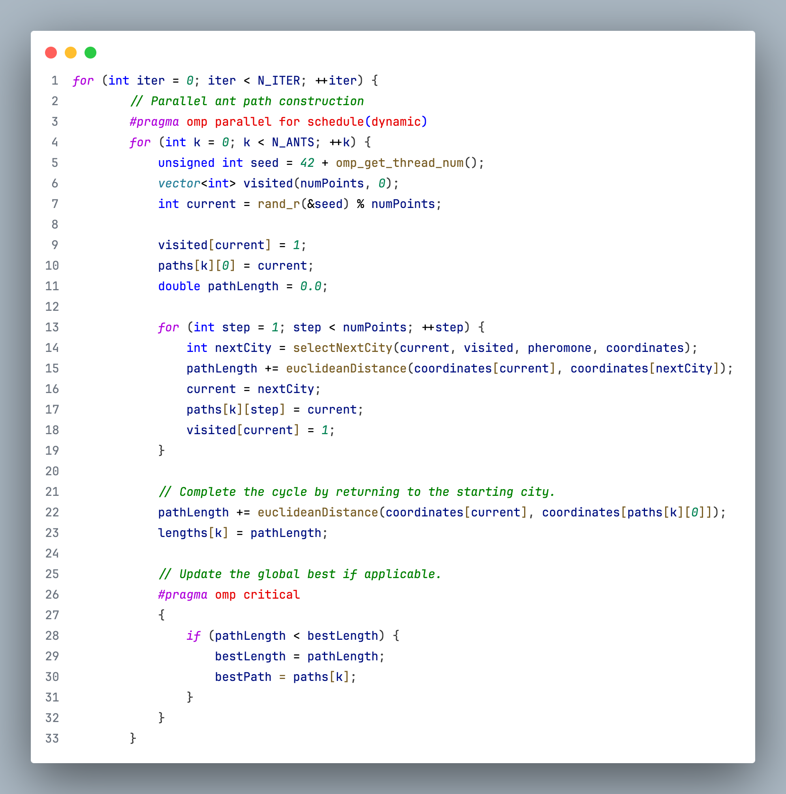
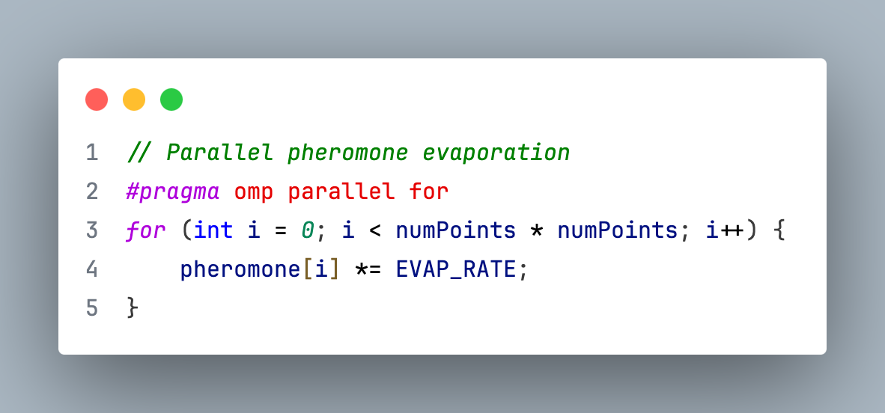
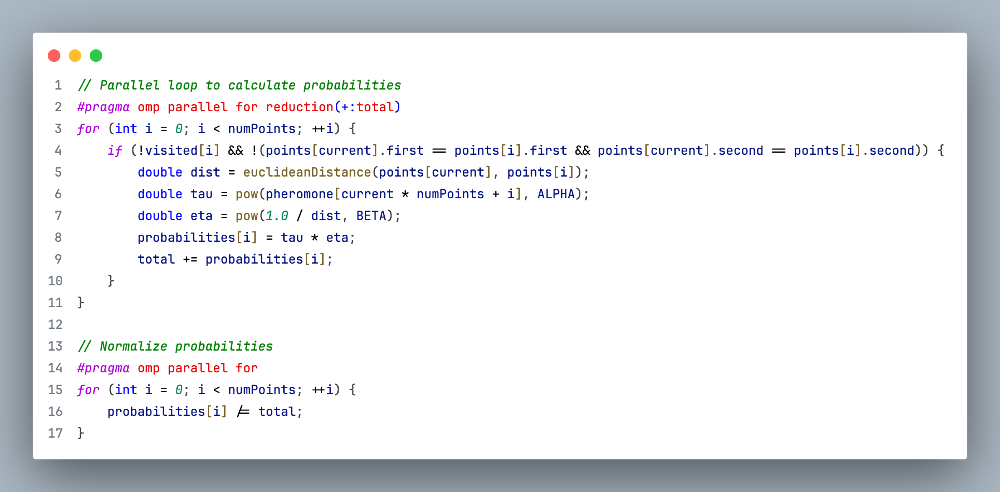
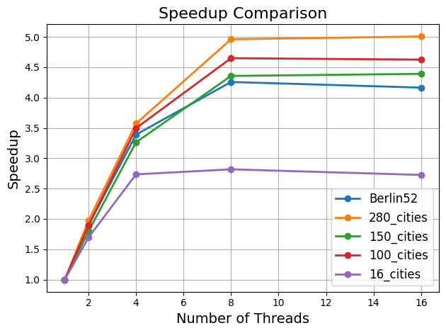
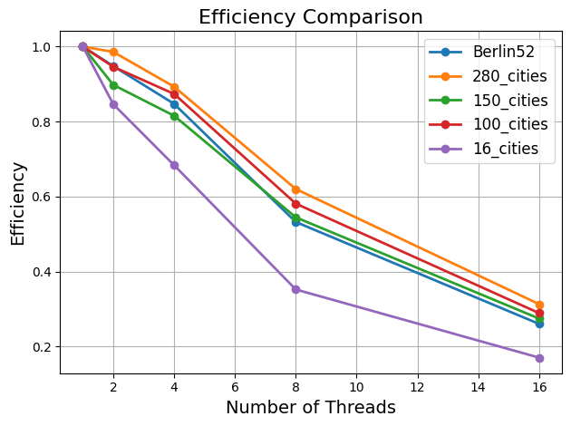
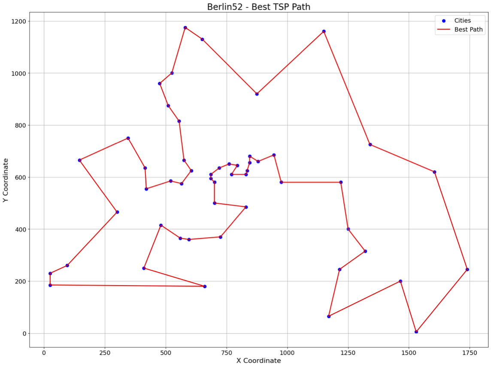
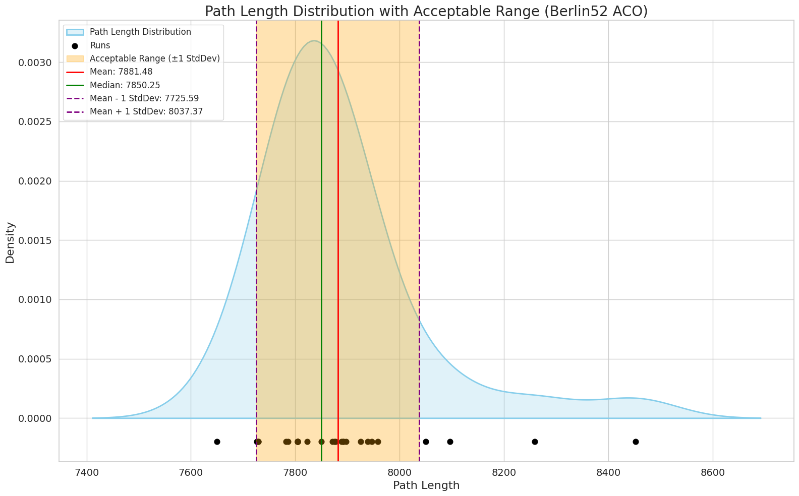
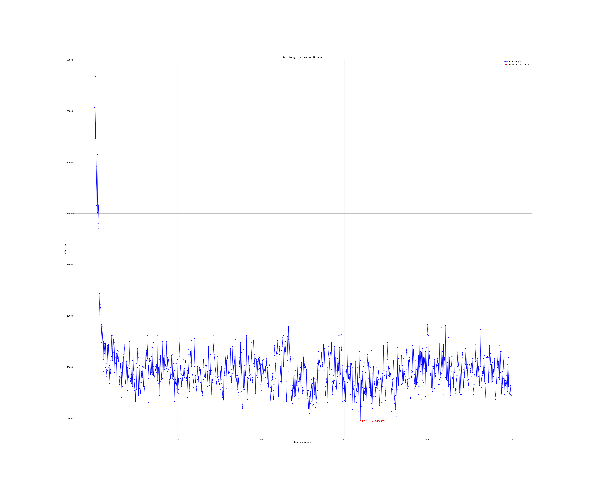

# Solving the Traveling Salesman Problem using Ant Colony Optimization and Multithreading

## Abstract

The Traveling Salesman Problem (TSP) is a foundational combinatorial optimization problem with applications in logistics, routing, and operations research. This project leverages Ant Colony Optimization (ACO), a bio-inspired metaheuristic, to solve TSP instances by mimicking the pheromone-based pathfinding behavior of real ants. To improve computational efficiency, the ACO algorithm was parallelized using OpenMP. Experimental results across multiple datasets—including Berlin52, 100-, 150-, and 280-point instances—demonstrate that the parallel implementation achieves substantial speedups, particularly for larger problem sizes. For example, the Berlin52 dataset achieved up to 4.26x speedup using 8 threads, while the 280-point dataset achieved a 5.00x speedup. Efficiency remained high at lower thread counts but decreased as more threads were added, especially for smaller problems—an expected outcome due to overhead and Amdahl’s Law. Overall, the results confirm that ACO maintains solution quality while benefiting significantly from parallelization, showing strong scalability and practical applicability for large-scale TSP problems.

## Introduction and Literature Review

### Introduction to the Traveling Salesman Problem

The Traveling Salesman Problem (TSP) is a classical problem in combinatorial optimization and graph theory. It asks the following: given a set of cities and the distances between each pair, what is the shortest possible route that visits every city exactly once and returns to the starting point? Despite its deceptively simple formulation, TSP is an NP-hard problem, meaning that no polynomial-time algorithm is known to solve all instances of it optimally. TSP has widespread applications in logistics, manufacturing, genome sequencing, circuit design, and more. Because of its computational complexity, TSP has become a benchmark problem for evaluating the performance of optimization heuristics and metaheuristics. Solving it efficiently—especially for large instances—remains an active area of research, particularly in the field of nature-inspired algorithms.

### Overview of Ant Colony Optimization

Ant Colony Optimization (ACO) is a population-based, probabilistic metaheuristic inspired by the foraging behavior of real ant colonies. In nature, ants find the shortest path to food sources by laying down pheromones and following paths with higher pheromone concentrations. The ACO algorithm simulates this behavior by deploying artificial ants that construct candidate solutions based on a combination of historical pheromone trails and problem-specific heuristics, such as the inverse of the distance between cities in the case of TSP. Over multiple iterations, ants reinforce promising solutions by depositing more pheromone on successful paths while evaporation mechanisms prevent stagnation. ACO balances exploration and exploitation, making it effective for a variety of discrete optimization problems. Its modularity, adaptability, and effectiveness in finding high-quality solutions make it a compelling alternative to classical exact methods, especially in large or dynamic environments.

### Literature and Prior Work

The ACO paradigm was first introduced by Marco Dorigo and colleagues in the early 1990s. The foundational work titled "Ant System: Optimization by a Colony of Cooperating Agents" by Dorigo, Maniezzo, and Colorni (1996) formalized the Ant System algorithm and demonstrated its effectiveness on several combinatorial problems, including the TSP. Their approach used a probabilistic transition rule that combines pheromone intensity and heuristic visibility, along with global pheromone updating strategies. Since then, numerous variations of ACO have been developed, such as Ant Colony System (ACS), MAX–MIN Ant System (MMAS), and Elitist Ant System, each incorporating improvements in convergence speed, solution quality, or avoidance of stagnation. In parallel, researchers have explored hybridizing ACO with local search techniques (e.g., 2-opt) and applying it to large-scale industrial problems. In the context of parallelization, several studies have shown that ACO lends itself well to data-parallel implementations, particularly for tour construction, though shared memory contention remains a challenge during pheromone updates.

### Applications of ACO
Ant Colony Optimization has been successfully applied to a wide variety of real-world problems beyond the classical TSP. Some notable applications include:

1. **Traveling Salesman Problem (TSP):** ACO remains one of the most widely studied metaheuristics for solving TSP due to its intuitive nature and performance.
2. **Vehicle Routing Problem (VRP):** Logistics companies use ACO to optimize delivery schedules and routes, accounting for capacity and time constraints.
3. **Network Routing:** In communication and computer networks, ACO is used for dynamic pathfinding, especially in mobile ad hoc networks.
4. **Genome Sequencing:** In bioinformatics, ACO helps in gene sequencing and alignment tasks by optimizing orderings with high similarity scores.
5. **Portfolio Optimization:** In finance, ACO can be used to optimize asset allocations that maximize returns under risk constraints.

These examples demonstrate ACO’s versatility in solving diverse optimization problems where the solution space is large, discrete, and complex.

## Parallelization Strategy

### Parallelizable sections of ACO
1. **Ant Path Construction (Main Parallel Section)**
    
    
    
    **What this does:**
    
    Each ant independently builds its tour. This includes:
    
    - Choosing a random starting city
    - Iteratively selecting the next city to visit using pheromone + distance info
    - Calculating the full tour length
    
    **Why this is parallelizable:**
    
    Each ant's work is **independent** (no shared data except reading the pheromone matrix), so this is embarrassingly parallel.

2. **Pheromone Evaporation**
    
    
    
    **What this does:**
    
    All pheromone levels on edges are decayed globally.
    
    **Why this is parallelizable:**
    
    Each pheromone value update is independent of others.

3. **Probability Computation in `selectNextCity()`** 
    
    
    
    **What this does:**
    
    Computes and normalizes the probability of choosing each possible next city using the pheromone and distance information.
    
    **Why this is parallelizable:**
    
    Each probability calculation is per-city and independent of others.

### **What kind of parallelism was used in the implementation and why?**

**A:** We used **data parallelism**, where each thread is responsible for simulating one or more ants independently. Since each ant constructs a complete tour without depending on the others, this model is naturally suited to the structure of the Ant Colony Optimization (ACO) algorithm.

We deliberately avoided **task parallelism**, which is more suited to heterogeneous or pipeline-style workloads. In our case, all tasks (ants) are of the same type and cost, making task parallelism unnecessarily complex and less efficient.

### **How did the number of threads affect performance?**

**A:** Speedup generally increased with more threads but **plateaued around 8 threads** across all datasets. Beyond that, the gains were minimal—due to overhead like context switching and memory contention.

Efficiency dropped as thread count increased, but improved with larger datasets at a fixed thread count. For example, 4-thread efficiency rose from 0.68 (16Points) to 0.89 (280Points). This suggests better thread utilization with heavier workloads and strong scalability, discussed later in the report.

### **What role did OpenMP barriers play in performance?**

**A:** We compared two synchronization approaches:

- Using `#pragma omp parallel for` (with an implicit barrier) for every `for` loop
- Using `#pragma omp parallel` with a nested `#pragma omp for` (with an explicit barrier)

On our setup, we found that the **implicit-barrier version performed better**. Since ants operate independently, forcing threads to wait at a barrier (explicitly) after each loop cycle only introduces **unnecessary synchronization overhead**.

However, it’s important to note that **for larger datasets**, the trade-off could change. In those cases, repeatedly spawning and destroying threads with `#pragma omp parallel for` may become more expensive than simply maintaining a fixed pool of threads across iterations. Therefore, **for large-scale problems**, using barriers may improve performance by reducing thread management overhead.

### **What about other parallelization details like scheduling type?**

**A:** We experimented with different **scheduling strategies** (`static`, `dynamic`, `guided`). All were used with data parallelism. While all three performed well, the difference was marginal compared to the impact of **thread count** and **barrier usage**.

Additionally, the following factors remained constant across experiments:

- Type of parallelism: data parallelism
- Pheromone update strategy: performed sequentially (due to write dependencies)

These were kept consistent to isolate the performance impact of thread-related parameters.

## Experiments and Results

### Speedup and Efficiency

**Dataset**: 16Points

**Description**: Consists of 16 distinct points that can be graphed

| **Number of threads** | **Execution time (s)** | **Speedup** | **Efficiency** |
| --- | --- | --- | --- |
| 1 | 0.583 | 1 | 1 |
| 2 | 0.344 | 1.69 | 0.85 |
| 4 | 0.213 | 2.73 | 0.68 |
| 8 | 0.207 | 2.82 | 0.35 |
| 16 | 0.214 | 2.72 | 0.17 |

**Dataset**: Berlin52

**Description**: Consists of 52 distinct coordinates of cities in Berlin, Germany.

| **Number of threads** | **Execution time (s)** | **Speedup** | **Efficiency** |
| --- | --- | --- | --- |
| 1 | 4.563 | 1 | 1 |
| 2 | 2.406 | 1.90 | 0.95 |
| 4 | 1.346 | 3.39 | 0.85 |
| 8 | 1.071 | 4.26 | 0.53 |
| 16 | 1.095 | 4.16 | 0.26 |

**Dataset**: Berlin100 (synthesized using generative AI from Berlin52)

**Description**: Consists of 100 distinct points that can be graphed

| **Number of threads** | **Execution time (s)** | **Speedup** | **Efficiency** |
| --- | --- | --- | --- |
| 1 | 15.953 | 1 | 1 |
| 2 | 8.430 | 1.90 | 0.95 |
| 4 | 4.564 | 3.5 | 0.87 |
| 8 | 3.431 | 4.65 | 0.58 |
| 16 | 3.448 | 4.63 | 0.29 |

**Dataset**: 150Points

**Description**: Consists of 150 distinct points that can be graphed

| **Number of threads** | **Execution time (s)** | **Speedup** | **Efficiency** |
| --- | --- | --- | --- |
| 1 | 32.621 | 1 | 1 |
| 2 | 18.163 | 1.79 | 0.89 |
| 4 | 9.998 | 3.26 | 0.81 |
| 8 | 7.487 | 4.36 | 0.54 |
| 16 | 7.428 | 4.39 | 0.27 |

**Dataset**: 280Points

**Description**: Consists of 280 distinct points that can be graphed

| **Number of threads** | **Execution time (s)** | **Speedup** | **Efficiency** |
| --- | --- | --- | --- |
| 1 | 113.687 | 1 | 1 |
| 2 | 57.649 | 1.97 | 0.99 |
| 4 | 31.824 | 3.57 | 0.89 |
| 8 | 22.913 | 4.96 | 0.62 |
| 16 | 22.703 | 5.00 | 0.31 |

Visualization of the Speedup and Efficiency across different datasets and number of threads.

### Cache Performance

| Sequential | Misses | Hits | Percentage of misses to hits |
| --- | --- | --- | --- |
| 2K | 7808772 | 2738627470 | 0.29% |
| 175K | 184266261 | 174318391319 | 0.11% |
| 612K | 746830707 | 578372753421 | 0.13% |

| Parallel (8 threads) | Misses | Hits | Percentage of misses to hits |
| --- | --- | --- | --- |
| 2K | 21830301 | 3528258059 | 0.62% |
| 175K | 206232746 | 171744916674 | 0.12% |
| 612K | 2094883817 | 622538745526 | 0.34% |

### Graphs and Visualization

1. **Near optimal solution to connect all 52 locations in Berlin**
    
    
    
2. **Kernel Density Plot showing an acceptable range of the length of the shortest path** for the Berlin52 dataset along with other statistical information.
    
    
    
    **Mean**: 8968.82
    
    **Median**: 8258.46
    
    **Standard Deviation**: 2000.55
    
    The **acceptable range of the solution should be in the range [6968.27, 10969.37]** (the orange region in the graph). For the purpose of academic experiments it may be appropriate to keep the acceptable range 1 unit of standard deviation plus/minus the mean length. However, in industry, these bounds can be determined by other business decisions; for instance, logistics costs and fuel costs for transportation and logistics companies such as FedEx and UPS.
    
3. A sample run showing the solutions the ACO algorithm comes up with for the Berlin52 dataset over 1000 iterations.
    
    
    
    The red dot and the text near it show the coordinates of the iteration and the minimum path length the algorithm came up with. In this case it is, (740, 7788.08), which means that the minimum (and best) path length was calculated on the 740th iteration with the best shortest path length = 7788.08 units.
    

## Discussion and Analysis

## Scalability

The scalability of the parallel ACO implementation demonstrates strong performance, particularly on larger TSP datasets. Speedup consistently improves with an increasing number of threads, with the 280-city dataset achieving a 5x speedup using 16 threads. Efficiency remains high at lower thread counts but gradually declines as threads increase, especially for smaller problem sizes—an expected tradeoff due to overhead and limited parallelism in certain parts of the algorithm. Overall, the results indicate that the implementation is **strongly scalable**, with larger datasets benefiting more from parallel execution, making it well-suited for solving complex, large-scale TSP instances efficiently.

## **Randomness and Reproducibility**

Randomness plays a central role in Ant Colony Optimization (ACO), as it allows agents (ants) to probabilistically explore a diverse range of solutions and avoid premature convergence to local optima. However, in scientific computing, especially in performance benchmarking and algorithm evaluation, reproducibility is equally important. In our implementation, we used `std::mt19937` as the random number generator, seeded with `42 + omp_get_thread_num() + iter * N_ANTS` to ensure that each thread and iteration received a distinct, deterministic stream of random numbers. This approach is both thread-safe and repeatable in isolation.

Despite this, exact reproducibility is not guaranteed in a parallel environment due to the non-deterministic nature of thread scheduling. Even with fixed seeds, differences in execution timing, especially during shared updates (e.g., pheromone updates inside critical sections), can lead to slight variations in results across runs. This is a common challenge in parallel stochastic algorithms, where thread-safe randomness alone does not imply deterministic behavior.

To achieve full reproducibility, a more controlled strategy is to precompute all random numbers before the start of the parallel execution. This involves generating a lookup table of random values indexed by iteration, ant, and decision step, and assigning them deterministically during execution. By eliminating all in-loop random number generation, this ensures that every ant receives the same sequence of random decisions in every run, regardless of thread scheduling. This strategy adds minimal overhead but provides complete control and replicability of experimental results.

That said, in most real-world scenarios, allowing some degree of randomness across runs is actually beneficial. It enables the algorithm to explore a wider range of the solution space, which often results in better average performance and helps prevent stagnation. A practical compromise is to perform multiple runs with different random seeds and report aggregate metrics such as mean, variance, and best-found solution. This balances the strengths of stochastic exploration with the robustness and reliability expected in empirical evaluations.

## **Conclusion**

This project successfully demonstrates the effectiveness of Ant Colony Optimization (ACO) in solving the Traveling Salesman Problem (TSP), particularly when enhanced through parallelization using OpenMP. By leveraging data parallelism, we were able to simulate multiple ants concurrently and significantly reduce execution times across various dataset sizes, achieving up to 5x speedup on the largest 280-point instance. The algorithm preserved solution quality while improving computational efficiency, validating ACO's robustness and scalability. Through extensive experimentation, we also explored the impact of thread count, scheduling strategies, and barrier usage on performance. The findings highlight the practicality of parallel metaheuristics for large-scale combinatorial optimization problems and underscore the importance of balancing randomness with reproducibility in stochastic algorithms. Overall, our work affirms ACO as a viable and scalable solution for real-world routing and optimization tasks.

## References

[1] M. Dorigo, V. Maniezzo, and A. Colorni, “Ant System: Optimization by a Colony of Cooperating Agents,” *IEEE Transactions on Systems, Man, and Cybernetics – Part B: Cybernetics*, vol. 26, no. 1, pp. 29–41, 1996.

[2] H. Darji and M. Nekhoroshkov, “Parallel ACO Implementation for the Traveling Salesman Problem,” *GitHub Repository*, [Online]. Available: https://github.com/nekhoros/AUCSC-450---TSP-Assignment/